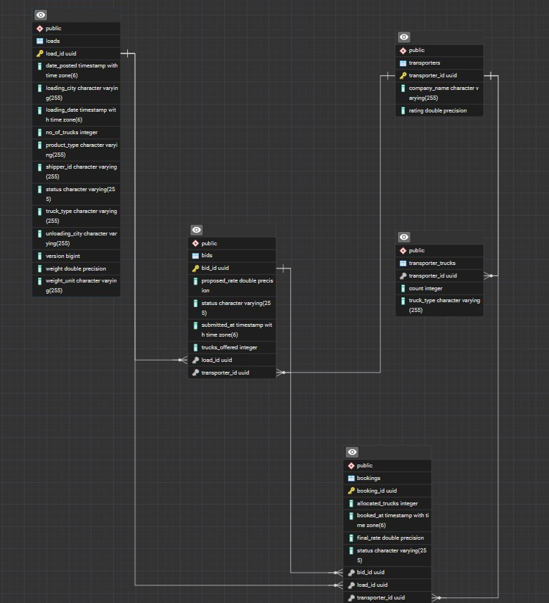

# Transport Management System (TMS) — Backend

This repository contains a Spring Boot backend for a Transport Management System (TMS)

Quick summary
- Java 17, Spring Boot 3.2.x, Spring Data JPA
- PostgreSQL as Database
- Key business rules implemented: capacity validation, load status transitions, multi-truck allocation, optimistic-lock concurrency protection (first-wins), best-bid calculation

---
## Database Schema Diagram

## API Documentation
Download and import Postman collection here:  
[Transport Management System Postman Collection](Transport%20Management%20System-1.postman_collection)

## Project Structure & Key Classes

### Controllers
- **LoadController**: Handles /load APIs (create, list, get, cancel, best-bids)
- **TransporterController**: Handles /transporter APIs (register, get, update trucks)
- **BidController**: Handles /bid APIs (submit, list, get, reject)
- **BookingController**: Handles /booking APIs (accept bid, get, cancel)

### Services
- **LoadServiceImpl**: Implements load creation, retrieval, cancellation, listing
- **TransporterServiceImpl**: Implements transporter registration, retrieval, truck updates
- **BidServiceImpl**: Implements bid submission, filtering, rejection, best-bid logic
- **BookingServiceImpl**: Implements bid acceptance, booking creation, cancellation

### Entities
- **Load, Transporter, Bid, Booking**: Core business entities

### DTOs
- **LoadDto, TransporterDto, BidDto, BookingDto**: Data transfer objects for API communication

### Exceptions
- **ResourceNotFoundException, InsufficientCapacityException, InvalidStatusTransitionException, LoadAlreadyBookedException**: Custom exceptions for business rules
- **GlobalExceptionHandler**: Maps exceptions to HTTP responses

---

## API Endpoints & Method Mapping

### Loads
- **POST /load**: LoadController.create → LoadServiceImpl.createLoad
- **GET /load**: LoadController.list → LoadServiceImpl.listLoads
- **GET /load/{loadId}**: LoadController.get → LoadServiceImpl.getLoad
- **PATCH /load/{loadId}/cancel**: LoadController.cancel → LoadServiceImpl.cancelLoad
- **GET /load/{loadId}/best-bids**: LoadController.bestBids → BidServiceImpl.getBestBids

### Transporters
- **POST /transporter**: TransporterController.register → TransporterServiceImpl.register
- **GET /transporter/{transporterId}**: TransporterController.get → TransporterServiceImpl.getTransporter
- **PUT /transporter/{transporterId}/trucks**: TransporterController.updateTrucks → TransporterServiceImpl.updateTrucks

### Bids
- **POST /bid**: BidController.submit → BidServiceImpl.submitBid
- **GET /bid**: BidController.list → BidServiceImpl.findByFilter
- **GET /bid/{bidId}**: BidController.get → BidServiceImpl.getBid
- **PATCH /bid/{bidId}/reject**: BidController.reject → BidServiceImpl.rejectBid

### Bookings
- **POST /booking?bidId={bidId}&allocateTrucks={n}**: BookingController.acceptBid → BookingServiceImpl.acceptBid
- **GET /booking/{bookingId}**: BookingController.get → BookingServiceImpl.getBooking
- **PATCH /booking/{bookingId}/cancel**: BookingController.cancel → BookingServiceImpl.cancelBooking

---

Requirements
- JDK 17+
- Maven 3.8+
- PostgreSQL

Build & Run
1. Build package 

   mvn -DskipTests package

2. Run the application :

3. The app starts on port 8080 by default.
